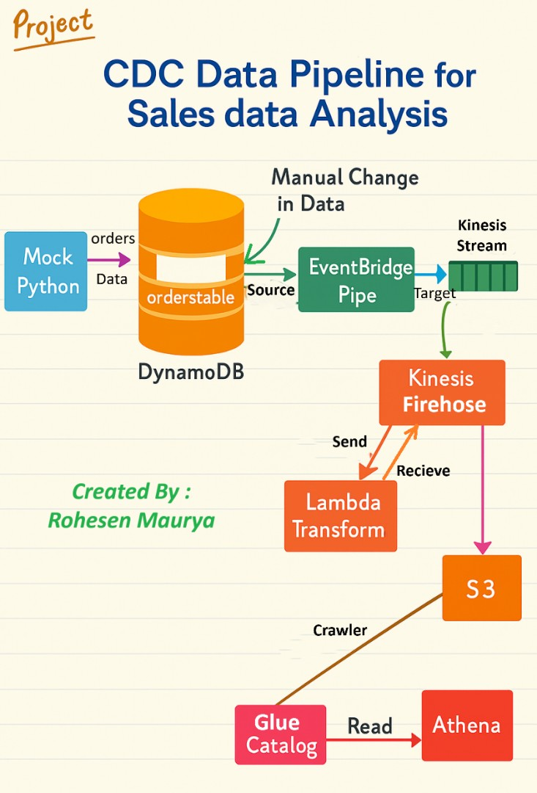

# 📊 Project 1: Gadget Sales Data Projection using DynamoDB and Kinesis

## 🚀 Project Overview

This project demonstrates a **Change Data Capture (CDC) pipeline** for sales data analysis using **AWS services**.
The pipeline continuously captures order data changes from **DynamoDB**, streams them through **EventBridge Pipe → Kinesis Firehose → Lambda**, stores transformed data in **S3**, and makes it queryable in **Athena** using **AWS Glue Catalog**.

---

## ⚙️ Architecture

The pipeline flow is as follows:

1. **Mock Data Generation**: A Python script continuously generates random order data and inserts it into DynamoDB (`OrdersRawTable`).
2. **DynamoDB**: Acts as the source of truth, holding sales order data.
3. **EventBridge Pipe**: Captures changes in DynamoDB (CDC).
4. **Kinesis Firehose**: Consumes the data stream from EventBridge Pipe.
5. **Lambda Transformation Layer**:

   * Decodes Kinesis data.
   * Transforms and enriches records with CDC metadata.
   * Encodes the transformed data and forwards it to Firehose.
6. **S3 Bucket (`kinesis-firehose-destination-rohes`)**: Stores transformed records as JSON files.
7. **Glue Crawler**:

   * Classifies JSON schema (`$.orderid, $.product_name, $.quantity, $.price, $.cdc_event_type, $.creation_datetime`).
   * Creates/updates the table inside `glue_sales_db`.
8. **Athena**: Queries and analyzes the data stored in S3.

   
---

## 📂 Project Structure

```
📦 gadget-sales-cdc-pipeline
 ┣ 📜 mock_data_generator_for_dynamodb.py   # Script to generate mock order data
 ┣ 📜 transformation_layer_with_lambda.py   # Lambda function for Firehose transformation
 ┣ 📂 screenshots/                          # Screenshots of S3 and Athena queries
 ┣ 📜 README.md                             # Project documentation
```

---

## 📝 Python Scripts

### 🔹 1. Mock Data Generator (`mock_data_generator_for_dynamodb.py`)

Continuously generates sales order data and pushes into DynamoDB.

```python
import boto3
import random
import time
from decimal import Decimal

session = boto3.Session(profile_name='default', region_name='ap-south-1')
dynamodb = session.resource('dynamodb')
table = dynamodb.Table('OrdersRawTable')

def generate_order_data():
    orderid = str(random.randint(1, 10000))
    product_name = random.choice(['Laptop', 'Phone', 'Tablet', 'Headphones', 'Charger'])
    quantity = random.randint(1, 5)
    price = Decimal(str(round(random.uniform(10.0, 500.0), 2)))
    return {'orderid': orderid, 'product_name': product_name, 'quantity': quantity, 'price': price}

def insert_into_dynamodb(data):
    table.put_item(Item=data)
    print(f"Inserted data: {data}")

if __name__ == '__main__':
    try:
        while True:
            data = generate_order_data()
            insert_into_dynamodb(data)
            time.sleep(1)
    except KeyboardInterrupt:
        print("\nScript stopped manually!")
```

---

### 🔹 2. Lambda Transformation Layer (`transformation_layer_with_lambda.py`)

Transforms and enriches raw DynamoDB CDC records before storing them in S3.

```python
import base64
import json
from datetime import datetime

def lambda_handler(event, context):
    output_records = []
    for record in event['records']:
        try:
            payload = base64.b64decode(record['data'])
            payload_json = json.loads(payload)
            event_name = payload_json['eventName']
            approx_creation_datetime = payload_json['dynamodb']['ApproximateCreationDateTime']
            creation_datetime = datetime.utcfromtimestamp(approx_creation_datetime).isoformat() + 'Z'
            new_image = payload_json['dynamodb']['NewImage']

            transformed_data = {
                'orderid': new_image['orderid']['S'],
                'product_name': new_image['product_name']['S'],
                'quantity': int(new_image['quantity']['N']),
                'price': float(new_image['price']['N']),
                'cdc_event_type': event_name,
                'creation_datetime': creation_datetime
            }

            transformed_data_encoded = base64.b64encode((json.dumps(transformed_data) + '\n').encode('utf-8')).decode('utf-8')

            output_records.append({'recordId': record['recordId'], 'result': 'Ok', 'data': transformed_data_encoded})
        except Exception:
            output_records.append({'recordId': record['recordId'], 'result': 'ProcessingFailed', 'data': record['data']})
    return {'records': output_records}
```

---

## 🛢️ Data Flow Verification

* **S3 Bucket** stores JSON files from Firehose:
  `firehose-kinesis-s3-nrt-batch-...`

* **Glue Catalog Table** (`glue_sales_db.kinesis_firehose_destination_rohes`) created by crawler.

* **Athena Query Example**:

```sql
SELECT * 
FROM kinesis_firehose_destination_rohes
LIMIT 10;
```

✅ Query results show **orderid, product_name, quantity, price, cdc_event_type, creation_datetime**.

---

## 📸 Screenshots

* **Athena Query Results**
* **S3 Bucket JSON Output**

(Screenshots included in `/screenshots/`)

---

## 🧑‍💻 Tech Stack

* **AWS DynamoDB** (CDC Source)
* **AWS EventBridge Pipe**
* **AWS Kinesis Firehose**
* **AWS Lambda**
* **AWS S3**
* **AWS Glue (Crawler + Data Catalog)**
* **AWS Athena**
* **Python (Mock Data + Lambda Transformation)**

---

## 🎯 Key Learnings

* How to capture **DynamoDB CDC events** in real-time.
* Transforming streaming data with **Lambda**.
* Using **Glue + Athena** for serverless analytics.
* End-to-end **data pipeline automation** with AWS services.

---

## 📌 Next Steps

* Add visualization using **Amazon QuickSight** or **Grafana**.
* Enhance schema with **partitioning** for optimized Athena queries.
* Extend CDC pipeline for **UPDATE** and **DELETE** event analysis.

---

🔗 **Author:** [Rohesen Maurya]
📅 **Date:** October 2025
